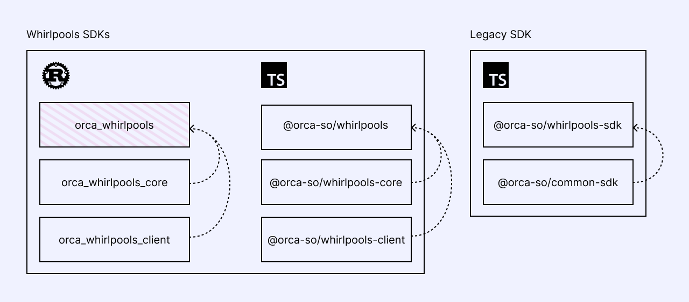

import DocCard from '@theme/DocCard';

# Welcome

On both the Solana and Eclipse networks, the Whirlpool Program runs as an open-sourced concentrated liquidity automated market maker (CLAMM). The program enables advanced DeFi operations such as creating liquidity pools and swapping.

<DocCard item={{
  type: 'link',
  href: 'https://github.com/orca-so/whirlpools',
  label: 'Whirlpools Program',
  description: 'https://github.com/orca-so/whirlpools'
}} />

## Overview of Orca Whirlpools SDK suite

Orca provides a range of SDKs that cater to different levels of development needs for interacting with the Whirlpool Program on Solana and Eclipse. Whether you are managing liquidity, building applications that require pool infrastructure, or building automation tools that interact with the program, our SDKs cover a spectrum of functionality from low-level granular control to high-level abstractions.

What follows is a brief overview of our SDK suite, distinguishing between the Whirlpools SDKs and the Legacy SDK, and explaining their intended purposes and relationships.

### Whirlpools SDKs

The Whirlpools SDKs are our primary set of SDKs designed to provide enhanced, modular interaction with the Whirlpool Program. This offering is divided into three main components:

#### 1. High-Level SDK
- **TypeScript**: [@orca-so/whirlpools](https://www.npmjs.com/package/@orca-so/whirlpools) (Requires Solana Web3.js SDK ≥v2.0)
- **Rust**: orca_whirlpools (in development)
- **Description**: The High-Level SDK is our top recommendation for anyone who wants to integrate with the Whirlpool Program. It builds upon the Low-Level and Core SDKs to provide an easy-to-use interface for interacting with the Whirlpool Program. This SDK abstracts many of the underlying complexities, such as tick array management, and makes managing pools and positions, and executing swaps much simpler. It is suitable for developers who need efficient, high-level functionalities and want to minimize manual configuration and management.

#### 2. Core SDK
- **TypeScript**: [@orca-so/whirlpools-core](https://www.npmjs.com/package/@orca-so/whirlpools-core)
- **Rust**: [orca_whirlpools_core](https://crates.io/crates/orca_whirlpools_core)
- **Description**: The Core SDK provides essential utilities for math operations and quotes, required for working with liquidity pools. This library focuses on calculations such as determining position status, price conversions, and computing quotes on adjusting liquidity and swaps. It is written in Rust but has been compiled to WebAssembly (Wasm) for easy integration into TypeScript projects.

#### 3. Low-Level SDK
- **TypeScript**: [@orca-so/whirlpools-client](https://www.npmjs.com/package/@orca-so/whirlpools-client) (Requires Solana Web3.js SDK ≥v2.0)
- **Rust**: [orca_whirlpools_client](https://crates.io/crates/orca_whirlpools_client) (Requires Solana SDK v1.18)
- **Description**: The Low-Level SDKs are autogenerated from our Interface Description Language (IDL) using Codama. This SDK provides direct program interactions and is designed for developers who need complete, low-level control over Whirlpool operations. It covers direct access to Solana accounts, instructions, and transactions.

### Legacy SDK
- **TypeScript**: [@orca-so/whirlpools-sdk](https://www.npmjs.com/package/@orca-so/whirlpools-sdk) (Requires Solana Web3.js SDK \<v2.0)
- **Description**: Despite being called "Legacy", this SDK remains a reliable choice for integrating with projects that use Solana Web3.js versions older than v2.0. It offers foundational tools for interacting with Orca's Whirlpool Program and includes utilities from @orca-so/common-sdk.

## How to use this documentation

In the next section you will find information about the Whirlpool Program and its architecture.

In the following sections you will find documentation on the Whirlpools SDKs and the Legacy SDK and how to use it to interact with the program.

If you have any questions or need help, feel free to reach out to us on the [Discord](https://discord.orca.so).