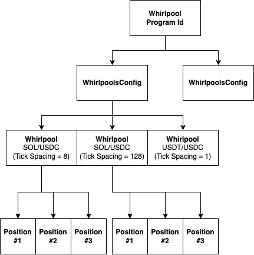

# Account Architecture

## Overview
Whirlpool program accounts are all [Program Derived Addresses (PDA)](https://solana.com/docs/core/pda) derivable from another Whirlpool account up the hierarchy. Use the PDAUtil class to derive the required addresses to access on-chain accounts.

### WhirlpoolsConfig

### WhirlpoolConfigExtension

### FeeTier

### Whirlpool

### TickArray

### Position

### PositionBundle

### TokenBadge