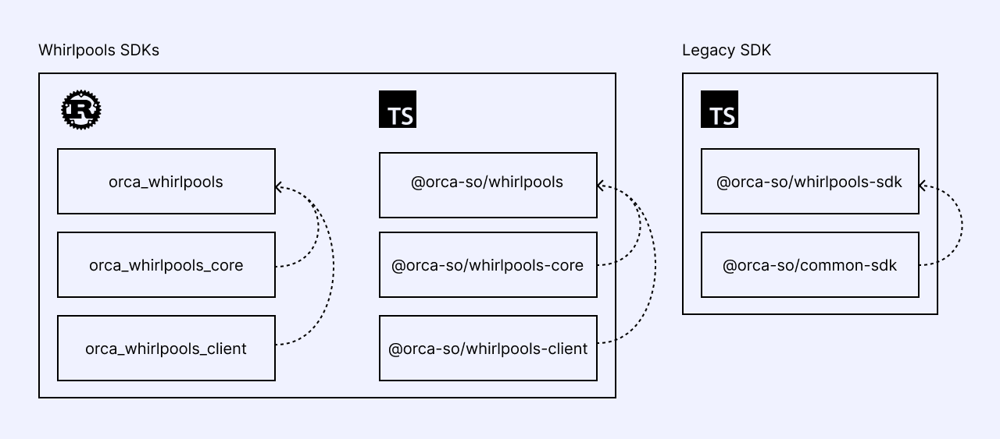

import Tabs from '@theme/Tabs';
import TabItem from '@theme/TabItem';

# Overview of Orca Whirlpools SDK suite



Orca provides a range of SDKs that cater to different levels of development needs for interacting with the Whirlpool Program on Solana and Eclipse. Whether you are managing liquidity, building applications that require pool infrastructure, or building automation tools that interact with the program, our SDKs cover a spectrum of functionality from low-level granular control to high-level abstractions.

What follows is an overview of our SDK suite, distinguishing between the various layers of the SDKs, and explaining their intended purposes and relationships.

## 1. High-Level SDKs
The High-Level SDKs are our top recommendation for anyone who wants to integrate with the Whirlpool Program. These SDKs abstract many of the underlying complexities, such as tick array management, and makes managing pools and positions, and executing swaps much simpler. It is suitable for developers who need efficient, high-level functionalities and want to minimize manual configuration and management.
- **Rust**: [orca_whirlpools](https://crates.io/crates/orca_whirlpools)
  - Compatible with Solana SDK versions `^1.18.0` but `<3.0.0`. By default, Cargo will install the latest version of Solana SDK `^v2`. This can cause dependcy issues when using older versions. To solve this you can apply a lockfile patch with the following command:
    ```bash
    cargo update solana-program:<current-version> --precise <required-version>
    ```
    You might also have to apply lockfile patches for `solana-program`, `solana-client`, `solana-account-decoder`, `spl-token`, `spl-memo`, `spl-token-2022`, `spl-associated-token-account`.
- **TypeScript Kit**: [@orca-so/whirlpools](https://www.npmjs.com/package/@orca-so/whirlpools)
  - Compatible with Solana Kit
- **Typescript Legacy**: [@orca-so/whirlpools-sdk](https://www.npmjs.com/package/@orca-so/whirlpools-sdk)
  - Compatible with Solana Web3.js. Despite being called "Legacy", this class-based SDK remains a reliable choice for integrating with projects that use Solana Web3.js. It offers foundational tools for interacting with Orca's Whirlpool Program and includes utilities from @orca-so/common-sdk.

## 2. Core SDKs
The Core SDKs provide essential utilities for **math operations** and **quotes**, required for working with liquidity pools. These libraries focus on calculations such as determining position status, price conversions, and computing quotes on adjusting liquidity and swaps. It is written in Rust but has been compiled to WebAssembly (Wasm) for easy integration into TypeScript projects.
- **Rust**: [orca_whirlpools_core](https://crates.io/crates/orca_whirlpools_core)
- **TypeScript Kit**: [@orca-so/whirlpools-core](https://www.npmjs.com/package/@orca-so/whirlpools-core)
- **TypeScript Legacy**: [@orca-so/whirlpools-sdk](https://www.npmjs.com/package/@orca-so/whirlpools-sdk)
  - The Legacy SDK has has separate utility classes for certain math operations such as `PoolUtil`, `TickUtil`, `TickArrayUtil`, and `SwapUtils`. For quotes, there are separate functions exported, such as `decreaseLiquidityQuoteByLiquidity`, `increaseLiquidityQuoteByInputToken`, `swapQuoteByInputToken`, `collectFeesQuote`, `collectRewardsQuote`, and more. Check out the reference docs in the navbor for more details.

## 3. Low-Level SDKs
This SDK provides direct program interactions and is designed for developers who need complete, low-level control over Whirlpool operations. It covers direct access to Solana accounts, instructions, and transactions.
- **Rust**: [orca_whirlpools_client](https://crates.io/crates/orca_whirlpools_client)
  - Compatible with `anchor` versions `^0.26` but `<0.30`. If you enable the `anchor` feature of `orca_whirlpools_client` in `cargo.toml` while using a version of anchor that's `^0.30` in your project, you may need to apply a lockfile patch to switch to a lower version:
    ```bash
    cargo update anchor:<current-version> --precise 0.29
    ```
  - Compatible with `solana-program` versions `^1.18.0` but `<3.0.0`. By default, Cargo will install the latest version of Solana SDK `^v2`. This can cause dependcy issues when using older versions. To solve this you can apply a lockfile patch with the following command:
    ```bash
    cargo update solana-program:<current-version> --precise <required-version>
    ```
  - NOTE: if you are dealing with compatibility issues for both `anchor` and `solana-program`, the order of the patches matters. First patch `anchor`, then patch `solana-program`.
- **TypeScript Kit**: [@orca-so/whirlpools-client](https://www.npmjs.com/package/@orca-so/whirlpools-client)
  - Compatible with Solana Kit
- **Typescript Legacy**: [@orca-so/whirlpools-sdk](https://www.npmjs.com/package/@orca-so/whirlpools-sdk)
  - The Legacy SDK offers the `WhirlpoolIx` class which enables you to interface directly with the instructions of the Whirlpool Program.
